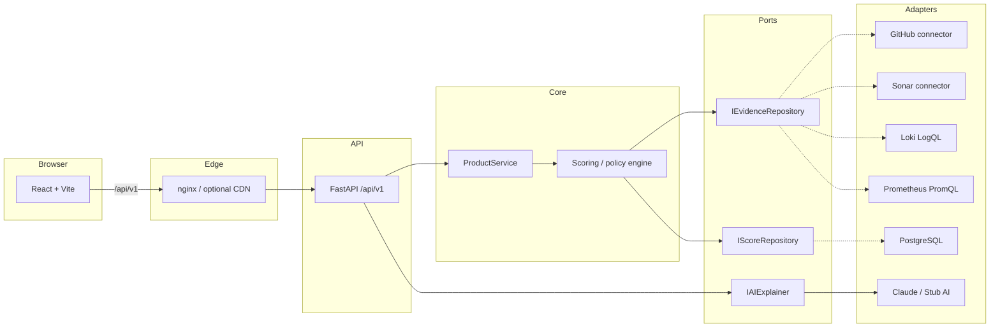
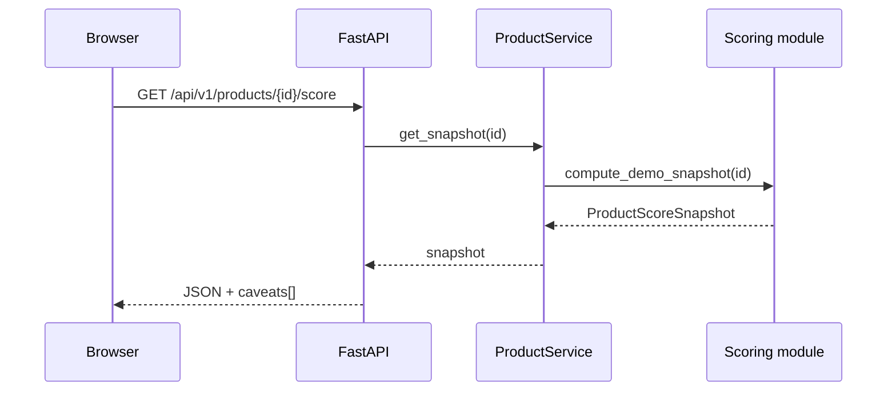
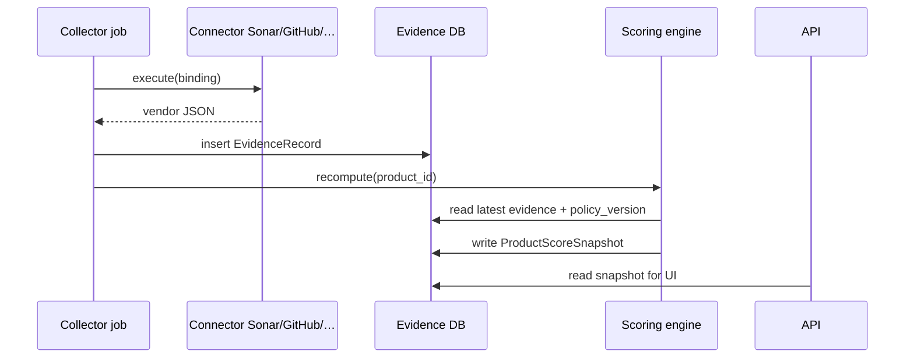

# VeloMatrix

**VeloMatrix** is an engineering **maturity matrix cockpit**: portfolio-level **0–10** scores, per-dimension **Sit / Crawl / Walk / Run** bands, evidence provenance, and a path to **config-driven connectors** (Prometheus, Loki, SonarQube, Snyk, CI systems, SQL warehouses, …) plus **GenAI explainability** (stub now, live adapter later).

The name mashes **velocity** with **matrix** — how fast your org moves *through* the maturity grid.

> **Open in Cursor:** `File → Open Folder…` →  
> `<userhome>/VeloMatrix`

## Why this repo exists

You wanted a serious platform shape (Amazon/Google-style clarity) with:

- A **professional** React dashboard (pastel light + dark mode).
- **Hexagonal** FastAPI backend (same spirit as [Sentinel](https://github.com/nanda13kumar/sentinel)).
- **Config + evidence** first — scores are never “magic UI,” they’re policy + signals.
- **Augur-style** honesty: caveats ship with payloads ([Augur](https://github.com/nanda13kumar/augur)).

This scaffold implements **routing + API contracts + pluggable connectors** + a **gitignored local workspace** (`local/demo-data/`) for catalog/bindings. Run `python3 scripts/seed_local_demo.py` to generate demo policy locally without committing scores to git.

---

## Repository layout

```text
VeloMatrix/
├── application.properties    ← HTTP ports + optional CORS extras (single source of truth)
├── README.md
├── docker-compose.yml
├── scripts/
│   ├── emit_compose_env.py   ← exports BACKEND_PORT / FRONTEND_PORT for Docker Compose
│   └── docker-up.sh          ← wraps docker compose with the exports above
├── docs/
│   ├── ARCHITECTURE.md
│   ├── DATA_MODEL.md
│   └── API.md
├── backend/
│   ├── Dockerfile            ← build context = repo root
│   ├── docker-entrypoint.sh  ← uvicorn port from application.properties
│   ├── requirements.txt
│   └── src/
│       ├── main.py           ← FastAPI factory (+ `python main.py` dev server)
│       ├── config.py         ← secrets from .env; ports from application.properties
│       ├── api/routes.py
│       ├── application/
│       ├── domain/
│       ├── adapters/
│       └── infrastructure/
│           └── application_properties.py
└── frontend/
    ├── Dockerfile            ← nginx template with BACKEND_PORT substitution
    ├── nginx/default.conf.template
    ├── vite.config.js        ← dev server + proxy ports from application.properties
    └── src/
        ├── App.jsx           ← overview + dimension drill-down
        ├── config.js
        ├── services/api.js
        └── styles/theme.css  ← pastel light + [data-theme="dark"]
```

---

## High-level architecture



---

## Request flows

### Portfolio score (v0 demo)



### Future: evidence-backed scoring



---

## Scoring model (summary)

| Level | Meaning |
|-------|---------|
| **Product** | Single **0–10** numeric, weighted sum of dimension numerics |
| **Dimension** | **Sit / Crawl / Walk / Run** band + numeric aggregate of sub-dimensions |
| **Sub-dimension** | **0–10** score × **weight** (0.1–1.0) + evidence + caveats |

Default band thresholds on dimension numeric \(S_D\):

| Band | Range (initial policy) |
|------|-------------------------|
| Sit | \[0, 2.5\) |
| Crawl | \[2.5, 5.0\) |
| Walk | \[5.0, 7.5\) |
| Run | \[7.5, 10\] |

**Non-negotiables** (e.g., missing SAST on release branches) will **cap** or **override** bands once policy rows exist in PostgreSQL.

Full narrative lives in your product brief; code implements the **demo** in `backend/src/application/scoring.py`.

---

## Ports: `application.properties`

HTTP ports are read **only** from the repo-root **`application.properties`** (with built-in defaults if a key is missing or blank):

| Key | Default | Used by |
|-----|---------|---------|
| `backend.port` | `8000` | FastAPI / Uvicorn, Vite dev proxy target, Docker backend listener + publish |
| `frontend.port` | `3000` | Vite dev server, default CORS allowlist on the API |
| `cors.extra.origins` | _(empty)_ | Optional comma-separated extra origins for the API |

Docker Compose cannot read `.properties` natively — use **`./scripts/docker-up.sh`** (or `eval "$(python3 scripts/emit_compose_env.py)"` before `docker compose …`) so host port mappings match the same file.

Optional override: set env **`APPLICATION_PROPERTIES=/absolute/path/to/application.properties`** (used in containers and by Vite if you point it in `frontend/.env`).

---

## Quick start (local)

Edit **`application.properties`** if you want non-default ports, then:

### Backend

```bash
cd backend
python3 -m venv .venv && source .venv/bin/activate
pip install -r requirements.txt
cp ../.env.example ../.env   # optional — secrets only; ports stay in application.properties
cd src
python main.py             # listens on backend.port from application.properties
```

Open **`http://localhost:<backend.port>/docs`** (see `GET /api/v1/bootstrap` for the resolved values).

### Frontend

```bash
cd frontend
npm install
npm run dev   # reads frontend.port + backend.port from application.properties
```

Open **`http://localhost:<frontend.port>`** — Vite proxies `/api` to `http://127.0.0.1:<backend.port>`.

### Docker (full stack)

```bash
cp .env.example .env   # optional secrets for compose
chmod +x scripts/docker-up.sh
./scripts/docker-up.sh up --build
```

Published ports follow **`application.properties`** via `scripts/emit_compose_env.py`. UI: **`http://localhost:<frontend.port>`**.

---

## API surface (v0)

| Method | Path | Notes |
|--------|------|------|
| GET | `/api/v1/health` | `genai_mode`: `stub` or `live` |
| GET | `/api/v1/bootstrap` | Resolved ports + `application.properties` path |
| GET | `/api/v1/products` | Product dropdown |
| GET | `/api/v1/products/{id}/score` | Full snapshot |
| POST | `/api/v1/products/{id}/dimensions/explain` | GenAI stub |

Details: [`docs/API.md`](docs/API.md).

---

## Roadmap (short)

1. PostgreSQL + Alembic for products, bindings, evidence, snapshots, audit.
2. Connector SDK + first real integrations (GitHub Actions, Sonar, Snyk).
3. Admin UI for bindings (LogQL / PromQL / SQL / REST).
4. Live GenAI adapter with redaction + policy guardrails.
5. AuthN/Z (OIDC), multi-tenant scopes, rate limits.

---

## License

Apache-2.0 — see [`LICENSE`](LICENSE).

---

Built so a principal engineer can **extend connectors without rewiring the UI**. Ship evidence, then scores, then narratives.
